# Instructivos de carga — Trinorma (poner el SGI al día)
> 2026-06-10 · Guías **paso a paso con capturas reales del sistema**. Cada bloque está redactado para enviar tal cual a su responsable.
> App: **https://trinorma.dassa.com.ar**

---

## 🔑 Cómo entrar (para todos)

1. Entrá a **https://trinorma.dassa.com.ar**.
2. Iniciá sesión con tu **correo @dassa.com.ar** y contraseña (la misma del SSO de DASSA Apps). Si no tenés acceso, tocá **"Solicitar acceso"**.

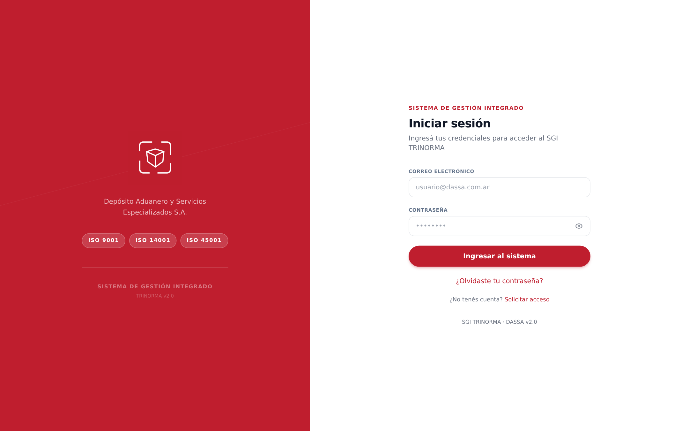

> El menú de la izquierda es siempre el mismo: arriba **INICIO** (Bienvenida, Mi Perfil, Mis Pendientes), en el medio los módulos del SGI, y abajo tu nombre. Cada instructivo te dice exactamente qué ítem del menú tocar.

---

## 📋 Para MARÍA (RRHH / Administración)

Hola María 👋. Para que TRINORMA quede al día y podamos activar comunicaciones, boletines y recordatorios de capacitación, necesito tres cargas. **La #1 es la más urgente.**

### 1) Datos de contacto del personal — PRIORITARIO
> Hoy **ningún** empleado tiene WhatsApp ni fecha de ingreso, y 24 de 32 no tienen email. Sin esto **no salen** avisos de capacitación, comunicados ni alertas.

**Paso 1 —** En el menú izquierdo, entrá a **RRHH → Empleados** (verás la lista de los 32). Fijate que en la columna **Contacto** casi todos dicen **"Sin WhatsApp"** en rojo: eso es lo que vamos a completar.

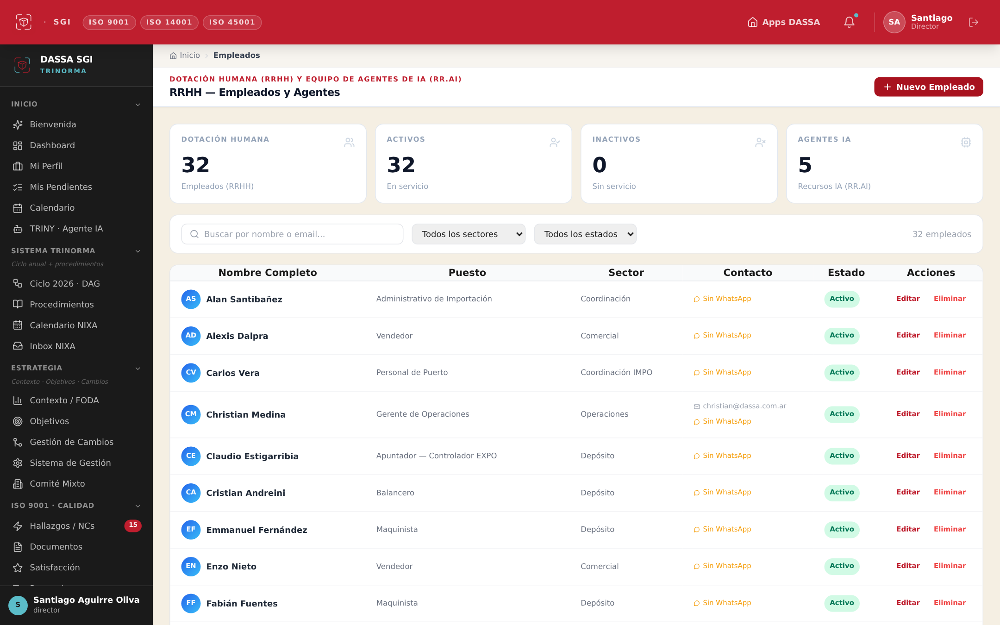

**Paso 2 —** En la fila de la persona, tocá **"Editar"** (columna **Acciones**, a la derecha). Se abre la ficha del empleado con pestañas arriba.

**Paso 3 —** Tocá la pestaña **"Contacto"** y completá **Email**, **Teléfono** y **WhatsApp** (y dirección si la tenés). El WhatsApp va con código: `+54 9 11 ...`.

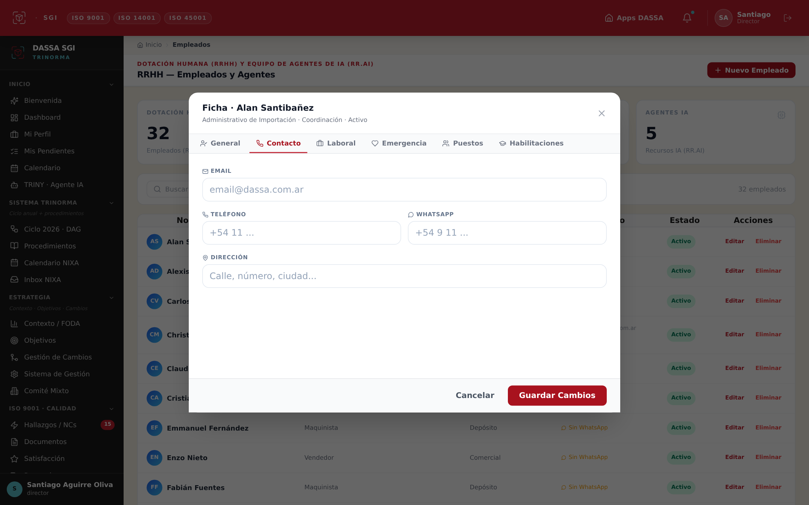

**Paso 4 —** Tocá la pestaña **"Laboral"** y cargá la **Fecha de ingreso** (antigüedad). Cuando termines, tocá el botón rojo **"Guardar Cambios"** abajo a la derecha.

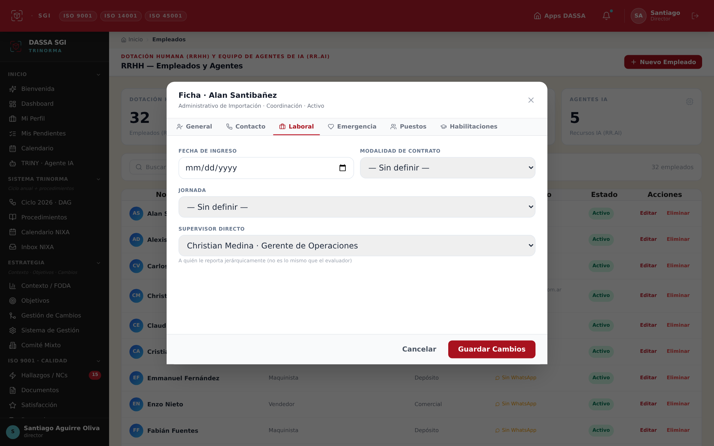

**Paso 5 —** Repetí con cada persona. Faltan email/WhatsApp de: *Alan Santibañez, Alexis Dalpra, Carlos Vera, Claudio Estigarribia, Cristian Andreini, Emmanuel Fernández, Enzo Nieto, Fabián Fuentes, Facundo Lastra, Federico Estigarribia, Francisco Urtubey, Franco Di Dio, Franco Pérez, Guillermo Jorge, Lidia Miño, Luna Villar, Marcos Coria, Mario Goroso, Matías Díaz, Maximiliano Sandoval, Nicolás Nuñez, Pepo, Rodolfo Espíndola, Toti.* (Los 8 que ya tienen email igual necesitan **WhatsApp + fecha de ingreso**.)

### 2) Capacitaciones ya dictadas
> Hoy hay **91 programadas** pero solo **1 figura completada**, sin asistentes ni evidencia. Lo que no está cargado, en auditoría "no existe".

**Paso 1 —** Menú izquierdo → **Capacitaciones**. Vas a ver las tarjetas; las que están en rojo dicen **"Fecha vencida"**.

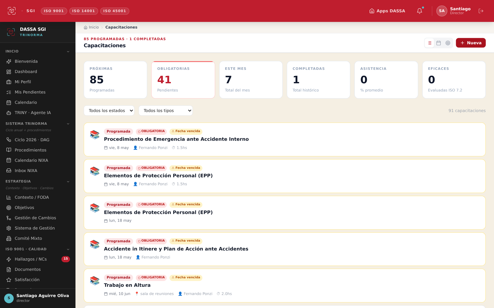

**Paso 2 —** Tocá la capacitación que **ya se dio** → marcá los **asistentes** y subí la **evidencia** (foto de la planilla de firmas). Guardá.

### 3) Reprogramar capacitaciones vencidas
Las que figuran **"Fecha vencida"** (p. ej. *Procedimiento de Emergencia ante Accidente Interno, EPP, Accidente in Itinere*) → abrilas y ponéles **nueva fecha**.

> Tu ficha de puesto ya quedó actualizada con tus tareas reales (RRHH, Tesorería, Contabilidad, Compras, Admin, SGI).

---

## ⚠️ Para MANUEL / Legal — URGENTE (riesgo operativo)

Hay **2 habilitaciones legales vencidas** — es lo más crítico del sistema (riesgo de multa / cierre operativo).

**Paso 1 —** Menú izquierdo → **Legal**. Arriba vas a ver el contador rojo **"VENCIDOS · 2"**, y en la lista el estado **"Vencido"** en rojo:

| Habilitación | Venció | Acción |
|---|---|---|
| **CAA — Certificado de Aptitud Ambiental** | 31-mar-2026 (≈71 días) | Renovar y cargar evidencia |
| **ADR — Homologación transporte cargas peligrosas (DG)** | 01-may-2026 (≈40 días) | Renovar y validar personal DG |

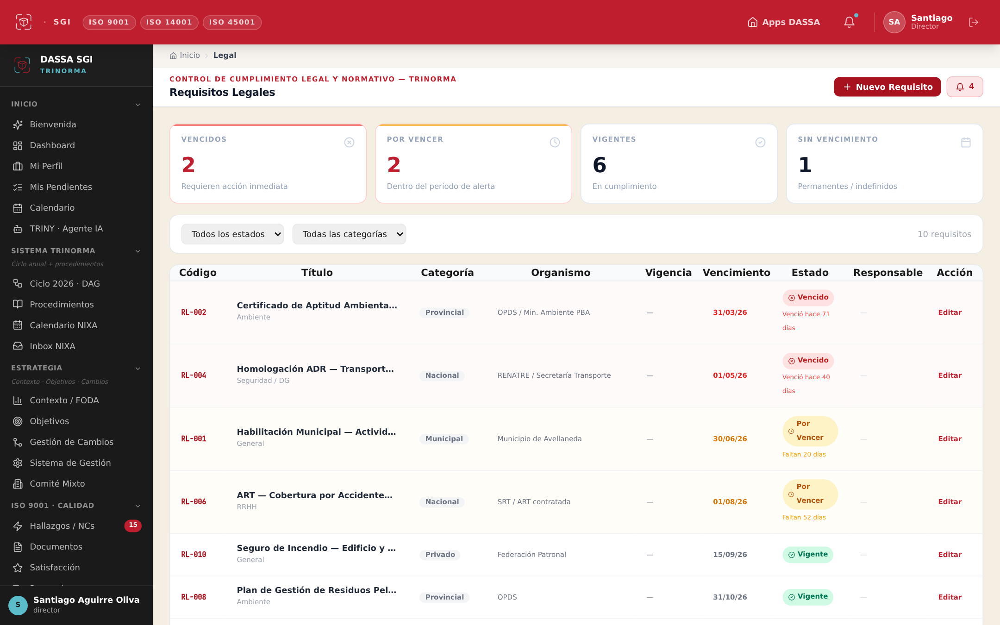

**Paso 2 —** Tocá **"Editar"** en la fila del **CAA**. Se abre el formulario del requisito.

**Paso 3 —** Actualizá la **Fecha Vencimiento** con la nueva, adjuntá la **evidencia** de renovación en **"Evidencia / Notas"** y asigná un **Responsable**. Guardá. Repetí con el **ADR**.

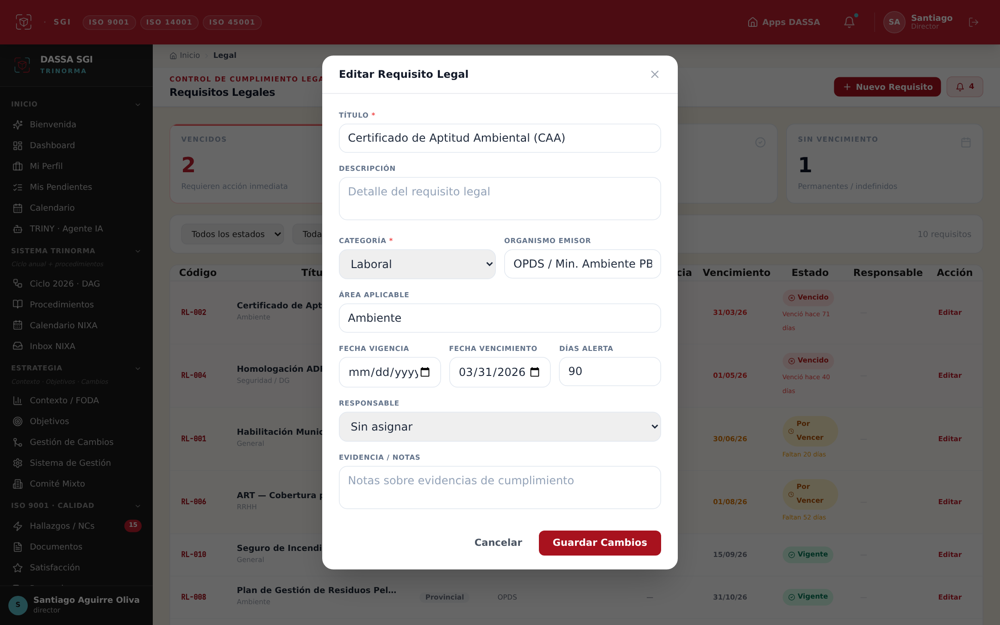

**Paso 4 —** Los **otros 10 requisitos legales nunca tienen fecha de verificación**. Abrilos uno por uno y dejá registrado "verificado el …" para la auditoría OEA.

---

## ⛑️ Para FERNANDO PONZI (Seguridad e Higiene)

Para cerrar **ISO 45001** faltan datos de tu área.

### 1) Incidentes (hoy hay **0 cargados**)
Menú izquierdo → **Incidentes**. Vas a ver todos los contadores en **0**. Tocá **"+ Nuevo Registro"** (arriba a la derecha) y cargá los accidentes / incidentes / casi-accidentes del período con su investigación (5W2H) y, si aplica, ART.

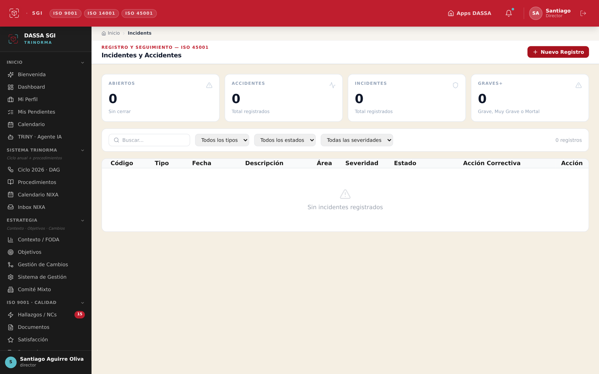

### 2) AMFE por puesto
Menú izquierdo → **Riesgos AMFE**. La matriz ya tiene 30 riesgos por proceso; falta **vincular los peligros a cada puesto**. Podés usar el botón **"Sugerir riesgos con IA"** y revisar lo que propone.

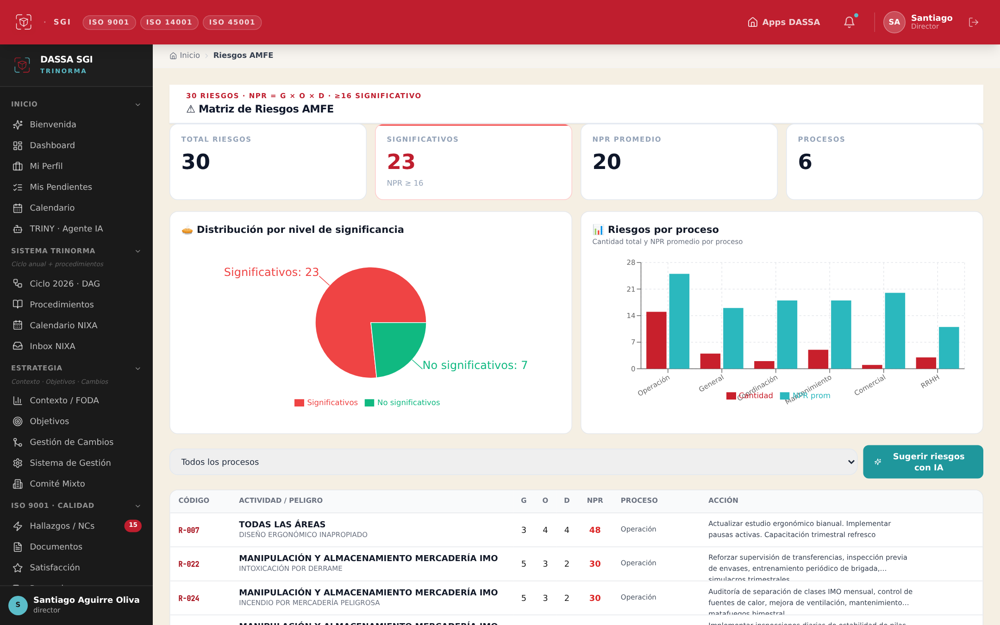

### 3) Rondas de inspección
Módulo listo, falta configurar: calibrar el **geofence** con la ubicación real de DASSA, revisar los **ítems de SSHH** del checklist y cargar la **flota real** de autoelevadores (hoy hay máquinas de prueba). *Esto lo coordinamos juntos.*

### 4) Capacitaciones SySO vencidas
En **Capacitaciones**, reprogramá las de tu área que figuran "Fecha vencida" (EPP, Emergencia Interna, etc.).

---

## ✅ Para NIXA (auditora externa) — validación

### 1) Validar el FODA 2026 (29 ítems)
Menú izquierdo → **Contexto / FODA**. Arriba hay una barra **"Validación del FODA 2026 con NIXA"** con el avance (validados / rechazados / pendientes). Cada punto tiene botones **Validar** / **Rechazar**. Cerrar esto **destraba las acciones de mejora y el ciclo 2026**.

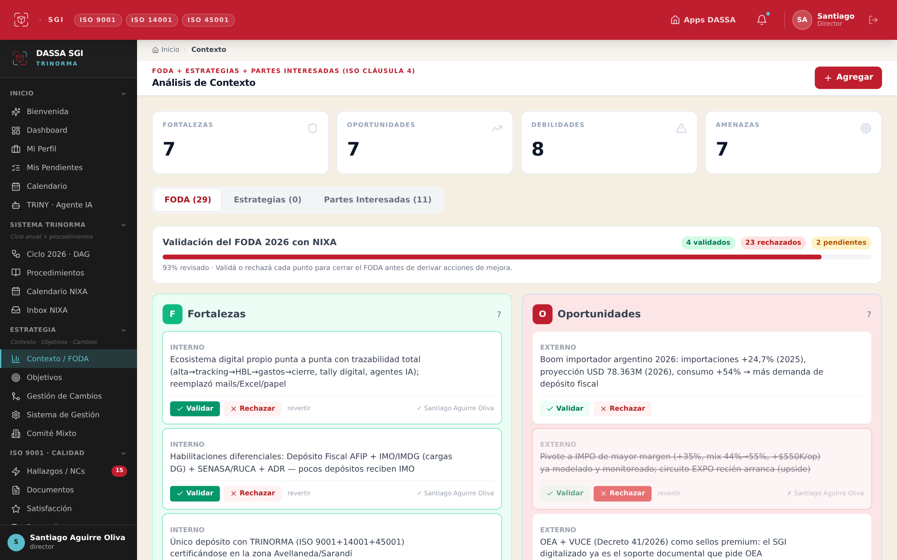

### 2) Requisitos legales
En **Legal**, verificá/firmá los 2 vencidos (CAA + ADR) + los 10 sin fecha de verificación.

### 3) Auditoría interna + reuniones
- Podés crear una reunión desde **Comité Mixto → "Nueva reunión"** (ya tenés el botón habilitado).
- Coordinar **auditoría interna** + **acta de revisión por la dirección** antes de la auditoría externa.

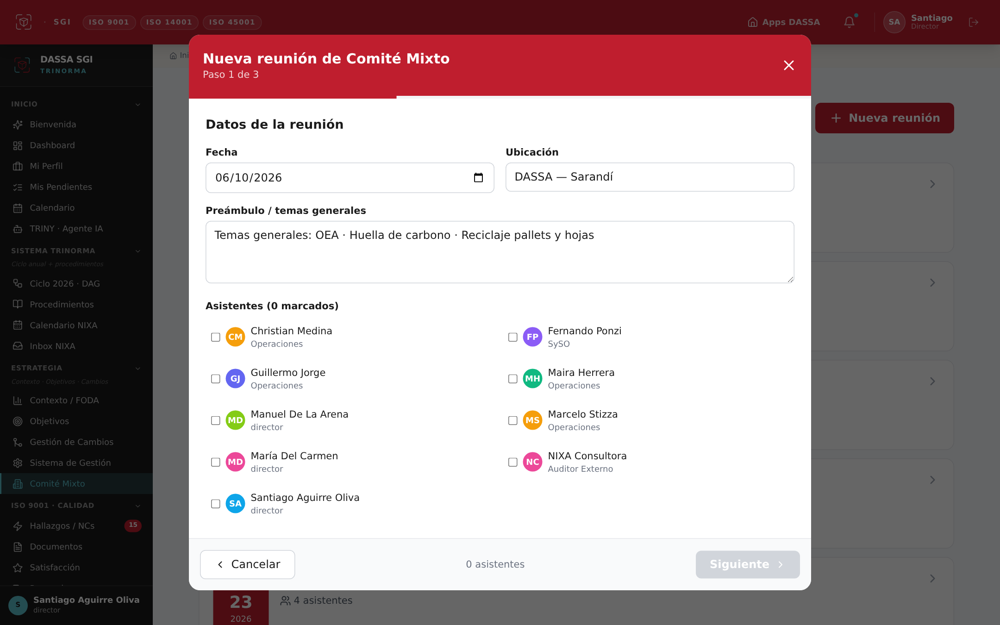

---

## 🏛️ Anexo — Cómo levantar una reunión de Comité (referencia)

Menú izquierdo → **Comité Mixto** → botón rojo **"Nueva reunión"**. El asistente tiene 3 pasos: **(1)** datos + asistentes, **(2)** revisión de pendientes del comité anterior, **(3)** nuevas tareas. Al cerrarla, TRINY firma el acta y manda el resumen por mail a toda la Trinorma.

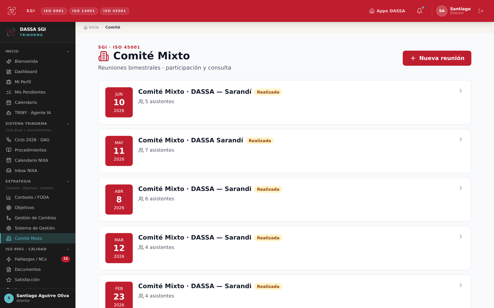

---
*Generado desde la revisión integral de Trinorma 2026-06-10 (ver `ESTADO-TRINORMA-2026-06-10.md`). Capturas tomadas del sistema en vivo.*
